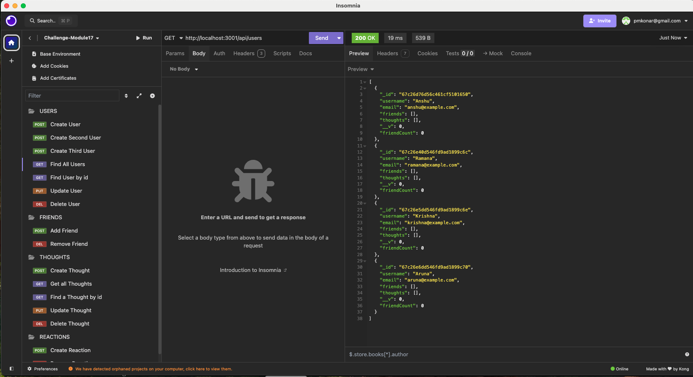

KoneTechI®  
  Feb, 2025
  
   
    
  # MK - Social Network Application

  ## Description
  A social network web application where users can share their thoughts, react to friends' thoughts, and create a friend list

  ## Table of Contents

  - [Installation](#installation)
  - [Usage](#usage)
  - [credits]()
  - [Contributing](#contributing)
  - [Tests](#tests)
  - [Video](#video)
  - [Screenshots](#screenshots)
  - [License](#license)
  - [Questions](#questions)

## Installation
1. Creeate a repository in GitHUB.
2. Clone to VSCode locally 
3. Create starter Code 
4. Once all code is developed  in an integrated terminal execute following command to start the application
   - npm  i 
   - npm build 
   - npm run seed
   - npm run start
 5. Test the API's in insomnia and share the reults 

## Usage
Test the API in insomnia for CURD operations of USER, FRIENDS, THOUGHTS, REACTIONS 

## Credits
Activities 25 and 26 of CURD subdoc, Instructor and TA's

## Contributing
Test and provide feedbacks 

 ## Tests
Test using insomnia API for CURD operations of USER, FRIENDS, THOUGHTS, REACTIONS

## Video

## Screenshots

## License
This project is licensed under the MIT license.

## Questions
For any questions, please contact me at [pmkonar@gmail.com](mailto:pmkonar@gmail.com).
You can also find more of my work at [muthukonar](https://github.com/muthukonar).

'This document was last updated on Feb, 2025'
